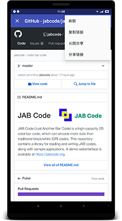

Gank
----

干货 - LiveData, ViewModel, Retrofit, RxJava, Dagger2 架构，采用kotlin语言开发，仅用于学习。
> 接口Api：https://gank.io/api
>
> demo下载：https://fir.im/x7w6

Screenshot
---

Reference
---
- LiveData
- ViewModel
- Lifecycle
- [Retrofit][retrofit]
- [RxJava2][rxJava]
- [Dagger2][dagger]

Points
------
- AppBarLayout、BottomNavigationView和FloatingActionButton在配合滑动列表滑动的时候隐藏/显示，[具体代码][BottomNavigationBehavior]
- Android 5.0上 webView 截取全屏方法，[具体代码-73到88行][interceptImage]
- 使用RecyclerView代替ViewPager分页查看图片，[具体代码][recyclerview_pager]
- Dagger2的使用
- ViewModel搭配LiveData的使用
- 使用Lifecycle来管理生命周期

TODO
---
- Jetpack组件`Navigation`和`Room`集成（Paging后续可能会加入）
- 添加浏览历史记录和收藏功能

License
---
Copyright 2018 Zheng Wang

Licensed under the Apache License, Version 2.0 (the "License");
you may not use this file except in compliance with the License.
You may obtain a copy of the License at

  http://www.apache.org/licenses/LICENSE-2.0

Unless required by applicable law or agreed to in writing, software
distributed under the License is distributed on an "AS IS" BASIS,
WITHOUT WARRANTIES OR CONDITIONS OF ANY KIND, either express or implied.
See the License for the specific language governing permissions and
limitations under the License.

[rxJava]:https://github.com/ReactiveX/RxJava
[dagger]:https://github.com/google/dagger
[retrofit]:https://github.com/square/retrofit
[BottomNavigationBehavior]:https://github.com/wazing/Gank/blob/master/app/src/main/java/com/wazing/gank/utils/BottomNavigationBehavior.kt
[interceptImage]:https://github.com/wazing/Gank/blob/master/app/src/main/java/com/wazing/gank/utils/Expands.kt
[recyclerview_pager]:https://github.com/wazing/Gank/blob/master/app/src/main/java/com/wazing/gank/ui/activity/ImagePageActivity.kt